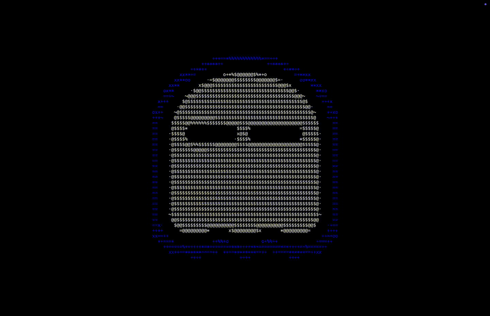

# Ghostty Screensaver

A macOS screensaver that animates ASCII frames, originally inspired by [ghostty.org](https://ghostty.org/).



## Installation

### Option A: Download from Releases

1. Download `ghostty.saver.zip` from the [latest release](https://github.com/initor/ghostty-screensaver/releases) (it saves to `~/Downloads` by default).
2. Unzip the file to get `ghostty.saver`.
3. Open Terminal and run:

> [!IMPORTANT]
> **You must run this command or macOS will say the file is "damaged and can't be opened."**
> This is not a bug — macOS blocks all unsigned downloads with a misleading error.
> The command below removes that block. It assumes the file is in `~/Downloads`;
> change the path if you saved it elsewhere.

```bash
xattr -r -d com.apple.quarantine ~/Downloads/ghostty.saver
```

4. Double-click the `.saver` file and follow any prompts to install.
   - Alternatively, manually move it to `~/Library/Screen Savers/`.

### Option B: Build from Source

1. Clone or download this repository.
2. Open the Xcode project.
3. Build the `.saver` target.
4. Find the `.saver` file in your `~/Library/Developer/Xcode/DerivedData/…/Build/Products/Debug/` (or “Products” in Xcode).
5. Double-click the `.saver` file and follow any prompts to install.
   - Copy or drag the `.saver` file into `System Settings → Screen Saver` or into `~/Library/Screen Savers/`.
6. Select `Ghostty Screensaver` in your Screen Saver preferences.

### Installation Issues & Troubleshooting

> "ghostty.saver is damaged and can't be opened"

This happens when macOS quarantine blocks an unsigned download. Remove the quarantine attribute:

```bash
xattr -r -d com.apple.quarantine ~/Downloads/ghostty.saver
```

Adjust the path if you unzipped it somewhere other than `~/Downloads`. Then double-click the `.saver` file again to install.

> "App cannot be opened because the developer cannot be verified"

macOS Gatekeeper may block the `.saver` file. To work around this:

1. System Settings (macOS Ventura or later):

- Open `System Settings → Privacy & Security`.
- Scroll down to the "Security" section. You should see a warning about "Ghostty.saver" being blocked.
- Click `"Open Anyway"` to allow installation.

2. Security & Privacy (macOS Monterey or earlier):

- Go to System Preferences → Security & Privacy → General.
- You might see a message that says "Ghostty.saver was blocked from opening because it is not from an identified developer."
- Click "Open Anyway" and confirm.

> [!NOTE]
> Once installed, if the new version of the screensaver doesn’t **load** immediately, try:

- Rebooting your Mac, or
- Killing the `legacyScreenSaver` processes in Activity Monitor (search for “legacyScreenSaver” and force quit).

macOS should then pick up the newly installed `.saver` file.

## Development

### Features

- Loads ASCII frames from `.txt` files in the screensaver’s Resources folder.
- Parses `<span class="b">...</span>` as blue `(0,0,230)`, everything else is white `(215,215,215)`.
- Animates frames at 30 FPS.
- Basic fallback if no frames are found.

## Credits

Original ASCII frames from [ghostty.org](https://ghostty.org/) via the [ghostty-org/website](https://github.com/ghostty-org/website/tree/main/terminals/home/animation_frames) repository.
