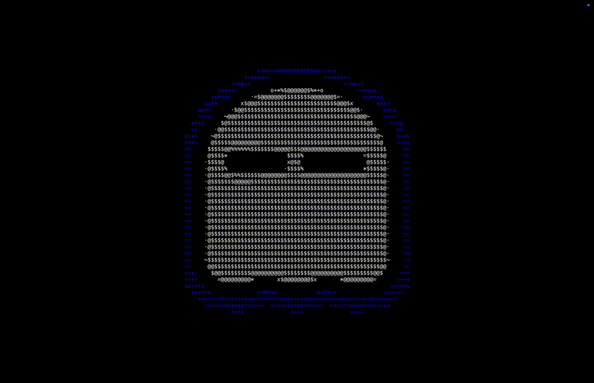
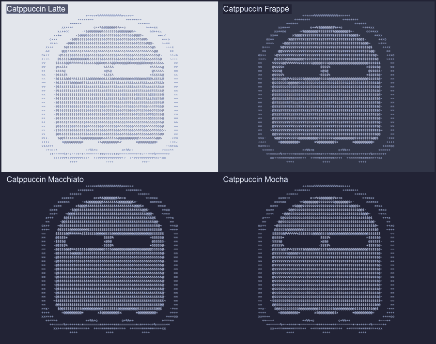

<div align="center">

# Ghostty Screensaver

<sub>An unofficial macOS screensaver of [Ghostty](https://ghostty.org/)'s homepage ASCII animation</sub>

<br>

[](https://github.com/initor/ghostty-screensaver/actions/workflows/build.yml)
[](https://github.com/initor/ghostty-screensaver/releases/latest)
[](https://github.com/initor/ghostty-screensaver/releases)
[](#install)
[](LICENSE)

<br>



</div>

---

> **Unofficial fan project.** Not affiliated with, endorsed by, or sponsored by [Ghostty](https://ghostty.org/) or Mitchell Hashimoto. The 235 animation frames come from the public [ghostty-org/website](https://github.com/ghostty-org/website) repo under MIT. See [Acknowledgements](#acknowledgements).

A native `.saver` bundle that loops the 235 frame ASCII animation from the Ghostty homepage. Pure Objective-C and Core Text, universal binary, 30 Hz, or 15 Hz in Low Power Mode. No Electron, no WebView, no daemons.

## Install

1. Download `ghostty.saver.zip` from the [latest release](https://github.com/initor/ghostty-screensaver/releases/latest) and unzip it.
2. Double-click `ghostty.saver`. macOS opens **System Settings → Screen Saver** and offers to install it.
3. Select **ghostty** in the list.

Requires macOS 12 or later, Apple Silicon or Intel.

<details>
<summary><b>macOS says the file is "damaged" or from an unidentified developer</b></summary>

Releases are not signed with an Apple Developer ID, so Gatekeeper refuses the quarantined download. The file is fine. Either:

- open **System Settings → Privacy & Security**, scroll to *Security*, and click **Open Anyway**, or
- clear the flag in Terminal, then open the file again:

  ```bash
  xattr -d -r com.apple.quarantine ~/Downloads/ghostty.saver
  ```
</details>

## Color schemes

The original look is the default. Four more schemes follow the [Catppuccin](https://catppuccin.com/) palette.



| Scheme | Background | Body | Accent |
|---|---|---|---|
| Classic (default) | `#000000` | `#d7d7d7` | `#0000e6` |
| Catppuccin Latte | `#eff1f5` | `#4c4f69` | `#1e66f5` |
| Catppuccin Frappé | `#303446` | `#c6d0f5` | `#8caaee` |
| Catppuccin Macchiato | `#24273a` | `#cad3f5` | `#8aadf4` |
| Catppuccin Mocha | `#1e1e2e` | `#cdd6f4` | `#89b4fa` |

To pick one:

1. Open **System Settings → Screen Saver** and select **ghostty**.
2. Click **Options…**.
3. Choose a scheme and click **OK**. The preview updates as you choose.

The choice is saved per user and per Mac. Latte is a light scheme: the whole screen goes light.

> On macOS 26, the **Options…** button sometimes does nothing. Quit System Settings, open it again, and click **Options…** once more.

## Uninstall

```bash
rm -rf ~/Library/Screen\ Savers/ghostty.saver
killall legacyScreenSaver 2>/dev/null
```

For an install under `/Library/Screen Savers/` (all users), use `sudo` and that path. The only other trace is one small preference file with the chosen scheme, inside the `legacyScreenSaver` container.

## FAQ

> **A new build does not show up after reinstalling.**

`legacyScreenSaver` caches `.saver` bundles. Run `killall legacyScreenSaver` (or reboot) and open System Settings again.

> **Does it work on several displays?**

Yes. Every display animates independently at the same rate. The frames load once per process and are shared.

> **What does it cost in battery and CPU?**

About 9 percent of one core at 30 Hz on an M4 at 1080p, about half that at 15 Hz in Low Power Mode. The view is layer-backed, so compositing runs on the GPU.

> **Can I use my own frames or colors?**

Frames: yes, see [FRAMES.md](FRAMES.md) and rebuild. Colors: the schemes are one table in `ghostty/GhosttyColorScheme.m`. A pull request that adds a row is welcome.

## Develop

See [CONTRIBUTING.md](CONTRIBUTING.md) for building, project layout, logs, the rendering checks, and releases.

## Acknowledgements

The 235 ASCII frames in `ghostty/static/animation_frames/` were created by the [ghostty-org/website](https://github.com/ghostty-org/website/tree/main/terminals/home/animation_frames) contributors and are reused here with attribution under MIT (Copyright (c) 2024 Ghostty). All artistic credit for the animation belongs to the upstream authors. The Catppuccin schemes use the [Catppuccin palette](https://github.com/catppuccin/palette) (Copyright (c) 2021 Catppuccin, MIT). The wrapper (view, frame loader, Options sheet, build pipeline) is original work.

If you are an upstream contributor and prefer different attribution wording, or want the frames removed, please open an issue.

## License

MIT. See [LICENSE](LICENSE). The frame corpus and the palette keep their upstream MIT notices, reproduced there.
