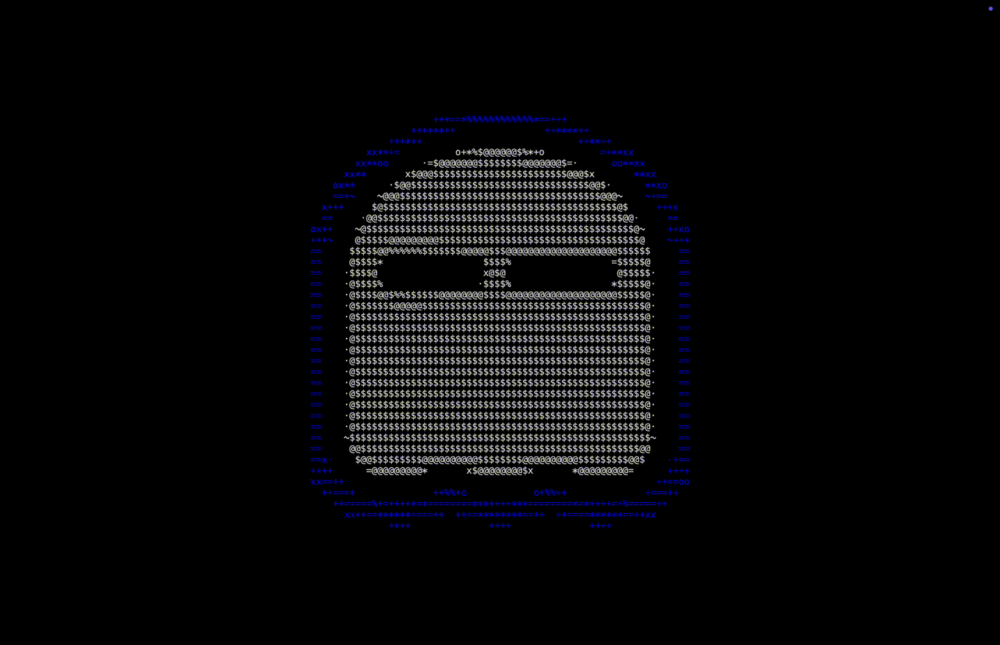
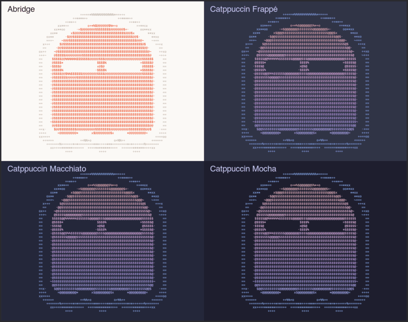

<div align="center">

# Ghostty Screensaver

<sub>An unofficial macOS screen saver of [Ghostty](https://ghostty.org/)'s homepage ASCII animation</sub>

<br>

[](https://github.com/initor/ghostty-screensaver/actions/workflows/build.yml)
[](https://github.com/initor/ghostty-screensaver/releases/latest)
[](https://github.com/initor/ghostty-screensaver/releases)
[](#install)
[](LICENSE)

<br>



</div>

---

> **Unofficial fan project.** Not affiliated with, endorsed by, or sponsored by [Ghostty](https://ghostty.org/) or Mitchell Hashimoto. See [Acknowledgements](#acknowledgements).

Light on the battery, with no helper apps.

## Install

Requires macOS 12 or later, on Apple Silicon or Intel.

1. Download [`ghostty.saver.zip`](https://github.com/initor/ghostty-screensaver/releases/latest/download/ghostty.saver.zip) and unzip it. Safari unzips it for you.
2. Clear the download flag. Open Terminal (press <kbd>⌘ Space</kbd>, type `Terminal`, press Return), paste this line, and press Return:

   ```bash
   xattr -d -r com.apple.quarantine ~/Downloads/ghostty.saver
   ```

   It prints nothing when it works. If the file is not in Downloads, type `xattr -d -r com.apple.quarantine` and a space, drag `ghostty.saver` onto the Terminal window, and press Return. Without this step, macOS says the file is "damaged" and refuses it. The file is fine. Releases are not signed with an Apple Developer ID, so macOS refuses the flagged download.
3. Double-click `ghostty.saver`. When asked, click **Install for this user only**.
4. Select **ghostty** in the [Screen Saver pane](#the-screen-saver-pane). To see it right away, hover over the preview at the top of the pane and click **Preview**.

### The Screen Saver pane

- macOS 26 and later: **System Settings → Wallpaper → Screen Saver**. **ghostty** is under *Other*.
- macOS 13 to 15: **System Settings → Screen Saver**.
- macOS 12: **System Preferences → Desktop & Screen Saver**.

## Color schemes

Classic, the original look, is the default. Three more follow the [Catppuccin](https://catppuccin.com/) palette: Frappé, Macchiato and Mocha. Each uses the flavor's base as the background and its blue as the halo. The body fades from peach through pink and mauve to that blue.



To pick one:

1. Open the [Screen Saver pane](#the-screen-saver-pane) and select **ghostty**.
2. Click **Options…**.
3. Choose a scheme and click **OK**. The preview updates as you choose.

The choice is saved per user and per Mac.

> On macOS 26, the **Options…** button sometimes does nothing. Quit System Settings, open it again, and click **Options…** once more.

## Update

1. In Downloads, move the old `ghostty.saver` and `ghostty.saver.zip` to the Trash. Otherwise the new one unzips as `ghostty 2.saver` and keeps its download flag.
2. [Uninstall](#uninstall) the old version.
3. [Install](#install) the new one. Your color choice is kept.

## Uninstall

1. In the Screen Saver pane, pick any other screen saver.
2. In Finder choose **Go → Go to Folder…**, paste `~/Library/Screen Savers`, press Return, and drag `ghostty.saver` to the Trash.
3. Log out or restart. Until then, on macOS 14 to 26 the old copy can stay loaded and keep drawing.

Or, after step 1, run this in Terminal. `killall` takes the place of step 3:

```bash
rm -rf ~/Library/Screen\ Savers/ghostty.saver
killall legacyScreenSaver 2>/dev/null
```

If you installed it for all users, it is in `/Library/Screen Savers` instead. Remove it with `sudo rm -rf "/Library/Screen Savers/ghostty.saver"`. A small settings file with your color choice stays behind. It is harmless.

## FAQ

> **macOS says `ghostty.saver` is "damaged".**

The download flag is still set, and the installed copy carries it too. Run step 2 of [Install](#install), double-click `ghostty.saver` again, click **Replace** if asked, and select **ghostty** again. Without Terminal: right after the message, open **System Settings → Privacy & Security**, scroll to *Security*, click **Open Anyway** if it is offered (it stays for about an hour), and select **ghostty** again.

> **It never starts on its own.**

The screen saver starts after the delay under **Start Screen Saver**: System Settings → Lock Screen on macOS 13 to 15, or Wallpaper → Screen Saver on macOS 26 and later. On macOS 12 it is **Show screen saver after**, in the same pane as the list. If a **Turn display off** setting under Lock Screen (Energy Saver or Battery on macOS 12) is shorter, the screen goes dark first. Set the screen saver delay shorter than it.

> **After an update, the old version still shows.**

Quit System Settings. Log out and back in, or run `killall legacyScreenSaver` in Terminal. Then open System Settings again.

> **`legacyScreenSaver (Wallpaper)` uses more CPU after every activation.**

On macOS 14 to 26, the system keeps an old copy of the screen saver running after each activation. Fixed in 2.1.1: the newest copy on each screen is the only one drawing, so update if you see this. If it still climbs on 2.1.1 or later, add your macOS version and display count to [issue #6](https://github.com/initor/ghostty-screensaver/issues/6).

> **Does it work on several displays?**

Yes. Every display animates independently at the same rate.

> **What does it cost in battery and CPU?**

About 9 percent of one CPU core while playing (M4, 1080p display), about half that in Low Power Mode, where the loop plays at half speed.

> **Can I use my own frames or colors?**

Frames: yes, see [FRAMES.md](FRAMES.md) and rebuild. Colors: the schemes are one table in `ghostty/GhosttyColorScheme.m`. A pull request that adds a row is welcome. See [CONTRIBUTING.md](CONTRIBUTING.md#color-schemes).

Still stuck? [Open a bug report](https://github.com/initor/ghostty-screensaver/issues/new?template=bug_report.yml).

## Develop

Pure Objective-C and Core Text, universal binary, 30 Hz (15 Hz in Low Power Mode). No Electron, no WebView, no daemons. See [CONTRIBUTING.md](CONTRIBUTING.md) for building, project layout, logs, the rendering checks, and releases.

## Acknowledgements

The 235 ASCII frames in `ghostty/static/animation_frames/` were created by the [ghostty-org/website](https://github.com/ghostty-org/website/tree/main/terminals/home/animation_frames) contributors and are reused here with attribution under MIT (Copyright (c) 2024 Ghostty). All artistic credit for the animation belongs to the upstream authors. The Catppuccin schemes use the [Catppuccin palette](https://github.com/catppuccin/palette) (Copyright (c) 2021 Catppuccin, MIT). The wrapper (view, frame loader, Options sheet, build pipeline) is original work.

If you are an upstream contributor and prefer different attribution wording, or want the frames removed, please open an issue.

## License

MIT. See [LICENSE](LICENSE). The frame corpus and the palette keep their upstream MIT notices, reproduced there.
